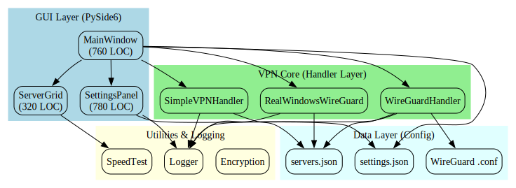
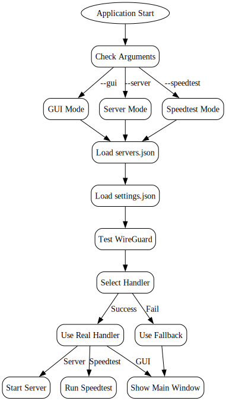
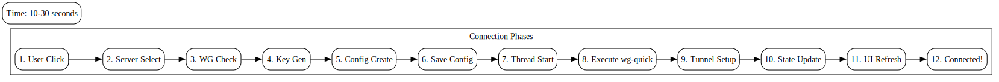
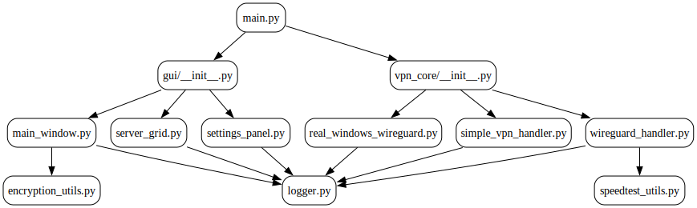
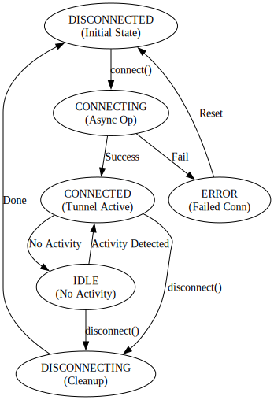
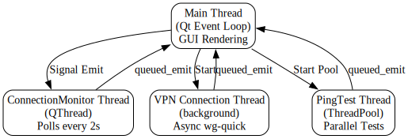
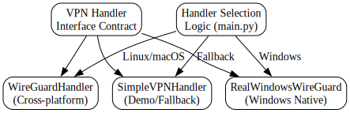
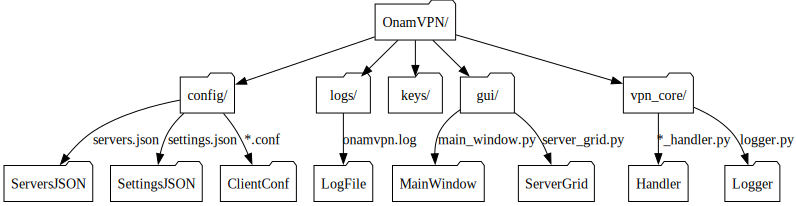

# 📚 OnamVPN Complete Project Documentation

## Table of Contents

1. [Project Overview](#project-overview)
2. [System Architecture](#system-architecture)
3. [Application Startup Flow](#application-startup-flow)
4. [VPN Connection Lifecycle](#vpn-connection-lifecycle)
5. [Module Dependencies](#module-dependencies)
6. [Connection State Machine](#connection-state-machine)
7. [Threading Model](#threading-model)
8. [Handler Polymorphism](#handler-polymorphism)
9. [File System Structure](#file-system-structure)
10. [Installation & Setup](#installation--setup)
11. [Usage Guide](#usage-guide)
12. [Development](#development)

---

## Project Overview

**OnamVPN** is a modern, cross-platform VPN application built with Python and PySide6. It provides a graphical user interface for managing VireGuard VPN connections with support for multiple servers, real-time ping testing, and comprehensive logging.

### Key Features

- ✅ **Cross-Platform GUI**: Works on Windows, Linux, and macOS with PySide6/Qt
- ✅ **WireGuard Integration**: Leverages WireGuard for secure VPN tunneling
- ✅ **Multiple Handlers**: Platform-specific implementations for optimal performance
- ✅ **Real-time Monitoring**: Continuous connection status and ping testing
- ✅ **Fallback Mode**: Works even without WireGuard installed (demo mode)
- ✅ **Server Management**: Support for multiple VPN servers with geolocation
- ✅ **Comprehensive Logging**: Rotating file logs with configurable verbosity
- ✅ **Settings Persistence**: User preferences saved in JSON format

### Technology Stack

| Component | Technology |
|-----------|-----------|
| GUI Framework | PySide6 (Qt for Python) |
| VPN Protocol | WireGuard |
| Encryption | Cryptography library (AES) |
| Logging | Python logging + RotatingFileHandler |
| Threading | Python threading + Qt QThread |
| Configuration | JSON |
| Package Manager | pip |

---

## System Architecture



### Architecture Layers

The application follows a **layered architecture** pattern:

#### 1. **GUI Layer (Presentation)**
- **MainWindow** (`gui/main_window.py`) - Primary UI controller
  - Manages window lifecycle
  - Handles user interactions
  - Updates connection status
  - Manages theme and language switching
  
- **ServerGrid** (`gui/server_grid.py`) - Server selection interface
  - Displays available servers as interactive cards
  - Shows real-time ping latency
  - Handles server selection
  - Performs concurrent ping testing

- **SettingsPanel** (`gui/settings_panel.py`) - Configuration dialog
  - Theme/language selection
  - User preference persistence
  - Settings validation
  - About/help information

#### 2. **VPN Core Layer (Business Logic)**
- **WireGuardHandler** - Cross-platform handler (Linux/macOS)
  - Direct WireGuard CLI integration
  - Key generation and management
  - Config file creation
  - Subprocess-based tunnel control

- **RealWindowsWireGuard** - Windows-specific handler
  - Windows path detection
  - WireGuard app integration
  - User-guided configuration flow

- **SimpleVPNHandler** - Demo/fallback handler
  - No WireGuard required
  - Simulated VPN behavior
  - Educational mode

#### 3. **Utilities Layer**
- **Logger** - Centralized logging system
  - File rotation (10MB per file, 5 backups)
  - Console + file output
  - Cross-platform log directory
  
- **SpeedTest** - Ping and speed testing
  - TCP socket connectivity test
  - ICMP ping measurement
  - Concurrent testing with ThreadPool
  
- **Encryption** - Cryptographic operations
  - AES encryption/decryption
  - Password hashing
  - Key derivation

#### 4. **Data Layer (Persistence)**
- **servers.json** - Server configuration
  - List of available VPN servers
  - Server metadata (location, country, endpoint)
  - Public keys for WireGuard
  
- **settings.json** - User preferences
  - Theme (light/dark)
  - Language selection
  - Window geometry
  - Connection history

- **Config Files** - WireGuard configurations
  - Client `.conf` files
  - Server `.conf` files
  - Timestamped backups

---

## Application Startup Flow



### Startup Sequence

```
1. main.py::__main__()
   ├─ Parse command-line arguments
   ├─ Determine application mode (GUI/Server/Speedtest)
   │
   ├─ Load Configuration
   │  ├─ Initialize logger
   │  ├─ Load servers.json
   │  └─ Load settings.json
   │
   ├─ Detect Platform & Handler
   │  ├─ Check system: Windows/Linux/macOS
   │  ├─ Test WireGuard installation
   │  └─ Select appropriate handler
   │
   └─ Launch Mode
      ├─ GUI Mode: Show MainWindow
      ├─ Server Mode: Start VPN server
      └─ Speedtest Mode: Run speed tests
```

### Handler Selection Logic

```python
if platform.system() == 'Windows':
    try:
        handler = RealWindowsWireGuard()
        if handler.test_wireguard_installation():
            vpn_handler = handler  # Real handler
        else:
            vpn_handler = SimpleVPNHandler()  # Fallback
    except:
        vpn_handler = SimpleVPNHandler()  # Fallback
else:  # Linux/macOS
    try:
        handler = WireGuardHandler()
        if handler.test_wireguard_installation():
            vpn_handler = handler  # Real handler
        else:
            vpn_handler = SimpleVPNHandler()  # Fallback
    except:
        vpn_handler = SimpleVPNHandler()  # Fallback
```

### Mode Details

#### GUI Mode (Default)
- Displays MainWindow with server grid
- Monitors connection status every 2 seconds
- Handles user interactions
- Saves settings on exit

#### Server Mode (`--server`)
- Starts a VPN server instead of client
- Listens on port 51820 (configurable)
- Accepts client connections
- Manages tunnel encryption/decryption

#### Speedtest Mode (`--speedtest`)
- Runs speed tests against all servers
- Measures ping latency
- Reports results in CSV format
- Useful for benchmarking

---

## VPN Connection Lifecycle



### Connection Phases (Detailed Timeline)

#### Phase 1-3: Initialization (< 1 second)
1. **User clicks "Connect"** on ServerCard
2. **Server selected** and validated
3. **WireGuard checked** for availability

#### Phase 4-6: Key Generation & Config (2-5 seconds)
4. **Private/public keypair generated**
   - Uses `wg genkey` command
   - Secure asymmetric cryptography
   
5. **WireGuard config created**
   - Interface section (address, DNS)
   - Peer section (server endpoint, public key)
   - Persistence settings
   
6. **Config file saved**
   - Platform-specific location
   - Read-only permissions (0600)

#### Phase 7-9: Thread & Tunnel Setup (10-30 seconds)
7. **Background thread started**
   - Offload blocking operation
   - Keep UI responsive
   - Non-blocking from user perspective
   
8. **`wg-quick up` executed**
   - Creates TUN/TAP interface
   - Configures routing rules
   - Establishes peer connection
   
9. **Tunnel established**
   - VPN interface active
   - Traffic routed through tunnel
   - Persistent keepalive enabled (25s)

#### Phase 10-12: Finalization (< 1 second)
10. **Connection state updated**
    - `handler.is_connected = True`
    - `handler.current_server = server`
    
11. **UI refreshed**
    - Status label updated
    - Connect button disabled
    - Disconnect button enabled
    - Server grid refreshed
    
12. **User sees "Connected" status**
    - VPN fully operational
    - Ping tests continue
    - Logs recorded

### On Disconnect

```
User clicks "Disconnect"
    ↓
handler.disconnect()
    ↓
Execute: wg-quick down [config_file]
    ↓
Delete temporary keys
    ↓
Update UI state
    ↓
Log completion
```

**Disconnect Duration:** 5-10 seconds

---

## Module Dependencies



### Import Hierarchy

```
main.py (Entry Point)
├─ gui/
│  ├─ main_window.py
│  │  └─ ServerGrid, SettingsPanel
│  ├─ server_grid.py
│  │  └─ SpeedTest utilities
│  └─ settings_panel.py
│     └─ JSON persistence
│
└─ vpn_core/
   ├─ wireguard_handler.py
   ├─ real_windows_wireguard.py
   ├─ simple_vpn_handler.py
   ├─ speedtest_utils.py
   ├─ logger.py
   └─ encryption_utils.py
```

### External Dependencies

```
PySide6            # Qt GUI framework
cryptography       # AES encryption
paramiko           # SSH (optional)
requests           # HTTP client (optional)
```

### Internal Dependencies

| Module | Depends On | Purpose |
|--------|-----------|---------|
| main.py | gui, vpn_core | Entry point, mode selection |
| MainWindow | ServerGrid, SettingsPanel, handlers | UI orchestration |
| ServerGrid | SpeedTest | Ping display, selection |
| SettingsPanel | logger | Settings persistence |
| WireGuardHandler | logger, speedtest | VPN operations |
| RealWindowsWireGuard | logger | Windows-specific VPN |
| SimpleVPNHandler | logger | Demo mode |
| SpeedTest | logger | Ping testing |
| Logger | logging | Centralized logging |
| Encryption | cryptography | Crypto operations |

---

## Connection State Machine



### State Definitions

#### **DISCONNECTED** (Initial State)
- No active VPN tunnel
- Handler ready to accept connections
- Default state after startup

#### **CONNECTING** (Transition)
- User initiated connection
- Background operation in progress
- UI shows loading spinner
- User cannot interact with connection controls

#### **CONNECTED** (Stable State)
- VPN tunnel fully established
- `wg show` confirms tunnel active
- Connection status displayed
- Ping tests continue
- User can disconnect at any time

#### **IDLE** (Substates)
- Connected but no recent activity
- Keepalive packets still sent
- Monitoring continues
- Timeout triggers if > 5 minutes idle

#### **DISCONNECTING** (Transition)
- User requested disconnection
- Cleanup operations in progress
- UI shows status

#### **ERROR** (Terminal)
- Connection attempt failed
- Error reason logged
- User can retry or select different server
- Automatic fallback to DISCONNECTED after reset

### State Transitions

| From | To | Trigger | Duration |
|------|----|---------|----|
| DISCONNECTED | CONNECTING | `connect()` | < 1s |
| CONNECTING | CONNECTED | Success | 10-30s |
| CONNECTING | ERROR | Failure | 1-30s |
| CONNECTED | IDLE | Inactivity | 5m+ |
| IDLE | CONNECTED | Activity | < 1s |
| CONNECTED/IDLE | DISCONNECTING | `disconnect()` | < 1s |
| DISCONNECTING | DISCONNECTED | Complete | 5-10s |
| ERROR | DISCONNECTED | Reset/Retry | < 1s |

### State Machine Code Location

**File:** `vpn_core/wireguard_handler.py`

```python
class ConnectionState(Enum):
    DISCONNECTED = "disconnected"
    CONNECTING = "connecting"
    CONNECTED = "connected"
    IDLE = "idle"
    DISCONNECTING = "disconnecting"
    ERROR = "error"
```

---

## Threading Model



### Thread Architecture

```
┌─────────────────────────────────────────────────────────┐
│                   Qt Event Loop                         │
│            (Main Thread - GUI Rendering)                │
│                                                         │
│  • UI event handling                                    │
│  • Signal/slot processing                              │
│  • OpenGL rendering                                    │
│  • NOT for blocking operations                         │
└─────────────┬───────────────────────────────────────────┘
              │
              ├─────────────────────────────────────────┐
              │                                         │
       ┌──────▼──────────┐              ┌─────────────▼────────┐
       │ ConnectionMonitor│              │ VPN Connection       │
       │   (QThread)     │              │ Thread (background)  │
       │                 │              │                      │
       │ • Polls every 2s│              │ • Async wg-quick     │
       │ • Checks status │              │ • Key generation     │
       │ • Emits signals │              │ • Config creation    │
       │ • Queued emit   │              │ • Subprocess calls   │
       │   to main       │              │ • Queued signal to   │
       │                 │              │   main thread        │
       └─────────────────┘              └──────────────────────┘
              │
              │
       ┌──────▼──────────────────────────────────┐
       │    PingTest Thread Pool                 │
       │    (concurrent.futures)                 │
       │                                         │
       │ • Worker 1: Ping Server 1               │
       │ • Worker 2: Ping Server 2               │
       │ • Worker 3: Ping Server 3               │
       │ • Worker 4: Ping Server 4               │
       │ (up to 8 parallel pings)                │
       │                                         │
       │ Results aggregated, queued to main      │
       └─────────────────────────────────────────┘
```

### Thread Specifications

#### Main Thread (Qt Event Loop)
- **Responsibility:** GUI rendering, user interaction
- **Duration:** Entire application lifetime
- **Blocking Operations:** None (all async)
- **Communication:** Receives signals from other threads

**Code Location:** `gui/main_window.py`

#### ConnectionMonitor Thread
- **Type:** QThread (Qt-aware threading)
- **Interval:** 2-second polling cycle
- **Operation:** Calls `wg show` to check tunnel status
- **Signal:** Emits `connection_status_changed` signal (queued)
- **Thread Safety:** Qt's signal/slot mechanism (thread-safe)

**Code Location:** `gui/main_window.py::ConnectionMonitor`

```python
class ConnectionMonitor(QThread):
    status_changed = pyqtSignal(dict)  # Queued signal
    
    def run(self):
        while self.is_running:
            status = self.handler.get_connection_status()
            self.status_changed.emit(status)  # Queued delivery
            time.sleep(2)
```

#### VPN Connection Thread
- **Type:** `threading.Thread` (background worker)
- **Trigger:** When user clicks "Connect"
- **Operation:** Blocks on `wg-quick up` (10-30 seconds)
- **Signal:** Sends custom signal when done
- **Cleanup:** Daemon thread, killed on app exit

**Code Location:** `vpn_core/wireguard_handler.py::_connect_thread`

```python
def _connect_thread(self, config_file, server):
    # This blocks for 10-30 seconds
    subprocess.run(['wg-quick', 'up', config_file])
    # Signal main thread when complete
    self.connection_complete.emit(True/False)
```

#### PingTest Thread Pool
- **Type:** `concurrent.futures.ThreadPoolExecutor`
- **Workers:** Configurable (default 4)
- **Task:** One ping per server
- **Timeout:** 5 seconds per test
- **Results:** Aggregated and sent to main thread

**Code Location:** `vpn_core/speedtest_utils.py::SpeedTestManager`

```python
executor = ThreadPoolExecutor(max_workers=4)
futures = [
    executor.submit(ping_server, server)
    for server in servers
]
results = [f.result(timeout=5) for f in futures]
```

### Thread Safety Mechanisms

1. **Qt Signal/Slot (Automatic Queueing)**
   - Signals sent from other threads → queued to main thread
   - Guarantees execution order
   - No deadlocks

2. **Shared Mutable State Protection**
   - `handler.is_connected`
   - `handler.current_server`
   - Protected by thread-local checks

3. **No Data Sharing Between Threads**
   - Each thread has its own data
   - Communication through signals only
   - Minimizes race conditions

---

## Handler Polymorphism



### Architecture Pattern: Strategy

The VPN handler system uses the **Strategy Pattern** to support multiple VPN implementations:

```python
# Common Interface
class VPNHandlerInterface:
    def connect_to_server(self, server_id: str) -> bool: ...
    def disconnect(self) -> bool: ...
    def get_connection_status(self) -> Dict: ...
    def test_wireguard_installation(self) -> bool: ...

# Concrete Strategies
class WireGuardHandler(VPNHandlerInterface):
    """Linux/macOS implementation"""
    # Uses wg-quick command
    
class RealWindowsWireGuard(VPNHandlerInterface):
    """Windows-specific implementation"""
    # Delegates to WireGuard app
    
class SimpleVPNHandler(VPNHandlerInterface):
    """Demo/fallback implementation"""
    # Simulates VPN without requirements
```

### Why This Pattern?

✅ **Extensibility:** Easy to add new handlers (MacOS-specific, WireGuard-Protocol, etc.)
✅ **Platform Flexibility:** Same codebase, different implementations
✅ **Testing:** Can swap real handler with mock
✅ **Graceful Degradation:** Falls back to demo mode if requirements missing

### Handler Selection (main.py)

```python
def select_vpn_handler():
    if platform.system() == "Windows":
        handler = RealWindowsWireGuard()
        return handler if handler.test_wireguard_installation() else SimpleVPNHandler()
    else:  # Linux/macOS
        handler = WireGuardHandler()
        return handler if handler.test_wireguard_installation() else SimpleVPNHandler()
```

### Handler Comparison

| Feature | WireGuardHandler | RealWindowsWireGuard | SimpleVPNHandler |
|---------|-----------------|---------------------|------------------|
| **Platforms** | Linux, macOS | Windows only | All |
| **Requires WireGuard** | Yes | Yes | No |
| **Real VPN Tunnel** | Yes | Yes | No (simulated) |
| **Automation** | Full | User-guided | N/A |
| **Speed** | 10-30s | (user-dependent) | 2s |
| **Code Size** | 420 LOC | 420 LOC | 320 LOC |
| **Use Case** | Production | Real Windows | Testing/Demo |

---

## File System Structure



### Directory Layout

```
OnamVPN/
├── main.py                    # Entry point (260 LOC)
├── setup.py                   # Installation metadata
├── requirements.txt           # Python dependencies
├── README.md                  # User guide
├── PROJECT_EXPLANATION.md     # Architecture overview
├── run.sh                     # Linux launcher
├── run.bat                    # Windows launcher
│
├── config/                    # Configuration files
│  ├── servers.json           # Available VPN servers (static)
│  ├── settings.json          # User preferences (dynamic)
│  ├── client.conf.template   # WireGuard client template
│  ├── server.conf.template   # WireGuard server template
│  ├── {server}_client.conf   # Generated client configs
│  ├── {server}_client-{ts}.conf  # Timestamped backups
│  └── OnamVPN-Server.conf    # Server-mode config
│
├── logs/                      # Application logs (rotating)
│  ├── onamvpn.log            # Current log (active)
│  ├── onamvpn.log.1          # Previous logs (archived)
│  ├── onamvpn.log.2          # ...
│  └── onamvpn.log.5          # (5 backups total, 10MB each)
│
├── keys/                      # Temporary encryption keys
│  ├── private_key            # WireGuard private key (transient)
│  └── public_key             # WireGuard public key (transient)
│
├── gui/                       # User Interface Module
│  ├── __init__.py
│  ├── main_window.py         # MainWindow class (760 LOC)
│  ├── server_grid.py         # ServerGrid widget (320 LOC)
│  ├── settings_panel.py      # Settings dialog (780 LOC)
│  └── __pycache__/           # Compiled Python bytecode
│
└── vpn_core/                  # VPN Core Module
   ├── __init__.py
   ├── wireguard_handler.py    # Cross-platform handler (420 LOC)
   ├── real_windows_wireguard.py  # Windows handler (420 LOC)
   ├── simple_vpn_handler.py   # Demo handler (320 LOC)
   ├── speedtest_utils.py      # Ping/speed testing (270 LOC)
   ├── logger.py               # Logging setup (220 LOC)
   ├── encryption_utils.py     # AES encryption (120 LOC)
   └── __pycache__/            # Compiled Python bytecode
```

### File I/O Patterns

#### On Startup
```
main.py
  ├─ [READ] servers.json       → Load server list
  ├─ [READ] settings.json      → Load user preferences
  ├─ [CREATE] logs/onamvpn.log → Initialize logger
  └─ [READY] for user interaction
```

#### On Connect
```
user.click("Connect") → handler
  ├─ [READ] servers.json                   → Get server details
  ├─ [GENERATE] wg genkey + wg pubkey       → Create keypair
  ├─ [CREATE] config/{server}_client.conf   → Save config
  ├─ [APPEND] logs/onamvpn.log              → Log connection
  ├─ [EXECUTE] wg-quick up ...               → Start tunnel
  └─ [APPEND] logs/onamvpn.log              → Log success/failure
```

#### On Settings Change
```
user.changes_theme() → SettingsPanel
  ├─ [READ] current settings.json
  ├─ [WRITE] settings.json with new theme
  ├─ [APPEND] logs/onamvpn.log              → Log change
  └─ [REBUILD] UI with new theme
```

#### On Disconnect
```
handler.disconnect()
  ├─ [EXECUTE] wg-quick down ...
  ├─ [DELETE] keys/* (if file-based)
  ├─ [APPEND] logs/onamvpn.log
  └─ [UPDATE] connection state
```

### Log Rotation Policy

```
Scenario: Continuous usage (lots of connections)

File Size Limits:
  • Active log:     10 MB max
  • Backup copies:  5 total
  • Total storage:  ~50 MB max

Rotation Mechanics:
  When onamvpn.log exceeds 10 MB:
    onamvpn.log    → onamvpn.log.1
    onamvpn.log.1  → onamvpn.log.2
    ...
    onamvpn.log.4  → onamvpn.log.5
    onamvpn.log.5  → [DELETED]
    [NEW FILE] created as onamvpn.log
```

---

## Installation & Setup

### Requirements

- **Python 3.8+**
- **PySide6** (Qt for Python)
- **WireGuard** (optional, for real VPN)
- **Graphviz** (optional, for diagrams)

### Installation Steps

#### 1. Clone Repository
```bash
git clone https://github.com/yourusername/onamvpn.git
cd onamvpn
```

#### 2. Install Python Dependencies
```bash
pip install -r requirements.txt
```

**requirements.txt includes:**
```
PySide6>=6.0.0
cryptography>=3.4
```

#### 3. Install WireGuard (Optional)

**Linux:**
```bash
sudo apt-get install wireguard wireguard-tools
```

**macOS:**
```bash
brew install wireguard-tools
```

**Windows:**
- Download from: https://www.wireguard.com/install/
- Run installer as Administrator

#### 4. Run Application
```bash
# GUI Mode (default)
python main.py

# Server Mode
python main.py --server

# Speedtest Mode
python main.py --speedtest
```

---

## Usage Guide

### Starting the Application

```bash
# Linux/macOS
./run.sh

# Windows
./run.bat

# Or directly
python main.py
```

### GUI Walkthrough

#### 1. **Server Selection**
- Displays grid of available VPN servers
- Shows real-time ping latency
- Color-coded by speed (green=fast, red=slow)
- Click a server card to select

#### 2. **Connection Control**
- **Connect Button** - Initiate VPN connection
- **Disconnect Button** - Tear down tunnel
- **Status Display** - Current connection state
- **Server Info** - Selected server details

#### 3. **Settings Panel**
- **Theme** - Switch between Light/Dark modes
- **Language** - English, Spanish, French, German
- **Export Settings** - Backup user preferences
- **Import Settings** - Restore from backup

#### 4. **Connection Status**
- Green dot = Connected
- Red dot = Disconnected
- Yellow = Connecting/Disconnecting
- Server name displayed when connected

### Typical Workflow

```
1. Launch Application
   → Shows MainWindow with server grid

2. Select a Server
   → Click on server card

3. Click "Connect"
   → Status changes to "Connecting..."
   → Wait 10-30 seconds
   → Status changes to "Connected"

4. Use VPN
   → All traffic routed through tunnel
   → Status refreshes every 2 seconds

5. Click "Disconnect"
   → Status changes to "Disconnecting..."
   → Tunnel tears down (5-10 seconds)
   → Status returns to "Disconnected"

6. Close Application
   → Settings auto-saved
   → Connection auto-closed
```

---

## Development

### Project Structure

```python
# Entry point
main.py
    └─ parse arguments
    └─ select mode (GUI/Server/Speedtest)
    └─ initialize handler
    └─ launch application

# GUI Layer
gui/
    ├─ main_window.py
    │   └─ MainWindow(handler)
    │       └─ manage UI lifecycle
    │       └─ handle user events
    │       └─ monitor connection
    │
    ├─ server_grid.py
    │   └─ ServerGrid widget
    │       └─ display servers
    │       └─ ping testing
    │
    └─ settings_panel.py
        └─ SettingsDialog
            └─ theme/language
            └─ preference persistence

# VPN Core
vpn_core/
    ├─ wireguard_handler.py      (Cross-platform)
    ├─ real_windows_wireguard.py (Windows)
    ├─ simple_vpn_handler.py     (Demo)
    ├─ speedtest_utils.py        (Utilities)
    ├─ logger.py                 (Logging)
    └─ encryption_utils.py       (Crypto)

# Data Layer
config/
    ├─ servers.json   (Server list)
    └─ settings.json  (User prefs)

# Logs
logs/
    └─ onamvpn.log*   (Rotating logs)
```

### Adding New Features

#### Adding a New Server
1. Edit `config/servers.json`
2. Add server entry with public key
3. Application auto-loads on startup

#### Adding a New Handler
1. Create `vpn_core/new_handler.py`
2. Implement `VPNHandlerInterface`
3. Update `main.py` selection logic
4. No UI changes needed!

#### Adding a New Setting
1. Add field to `SettingsPanel`
2. Update JSON schema
3. Add persistence logic
4. UI updates automatically

### Testing

```bash
# Run specific mode
python main.py --server    # Test server mode
python main.py --speedtest # Test speedtest

# Check logs
tail -f logs/onamvpn.log

# Manual testing
# 1. Connect to a server
# 2. Verify tunnel with: wg show
# 3. Test DNS: nslookup google.com
# 4. Check IP: curl ipinfo.io
```

---

## Troubleshooting

### Connection Issues

**Problem:** "WireGuard not found"
- **Solution:** Install WireGuard from https://www.wireguard.com/install/
- **Fallback:** Application auto-uses demo mode

**Problem:** "Permission denied" on Linux
- **Solution:** `sudo usermod -a -G wireguard $USER` then logout/login
- **Or:** Run with `sudo python main.py`

### GUI Issues

**Problem:** Theme not applying
- **Solution:** Close application, delete `settings.json`, restart

**Problem:** Servers not loading
- **Solution:** Check `config/servers.json` is valid JSON
- **Check logs:** `tail logs/onamvpn.log`

### Performance

**Problem:** High CPU usage during ping
- **Solution:** Reduce thread pool size in `speedtest_utils.py`
- **Check:** `SpeedTestManager(max_workers=2)`  # default is 4

**Problem:** Slow UI responsiveness
- **Solution:** Ensure VPN operations run in background threads
- **Check:** `ConnectionMonitor` thread is active

---

## Contributing

1. Fork repository
2. Create feature branch: `git checkout -b feature/new-feature`
3. Make changes with tests
4. Submit pull request

---

## License

OnamVPN is licensed under MIT License. See LICENSE file for details.

---

## Support

For issues, questions, or suggestions:
- **GitHub Issues:** https://github.com/yourusername/onamvpn/issues
- **Documentation:** See `system_design/` folder
- **Logs:** Check `logs/onamvpn.log` for debugging

---

**Last Updated:** March 30, 2026
**Project Status:** Active Development
**Version:** 1.0.0-beta
