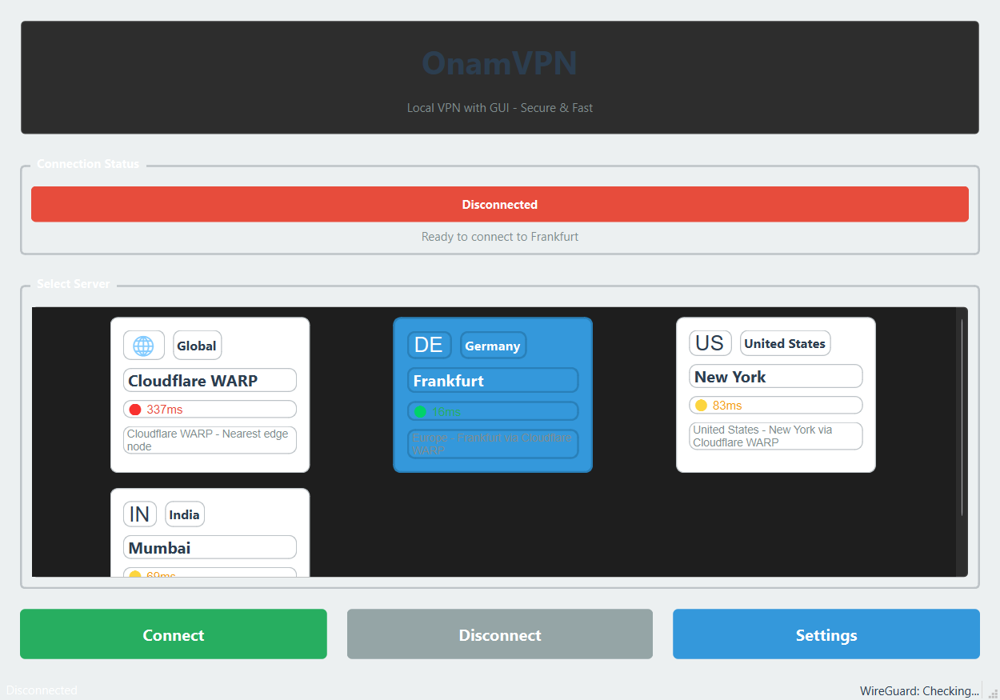
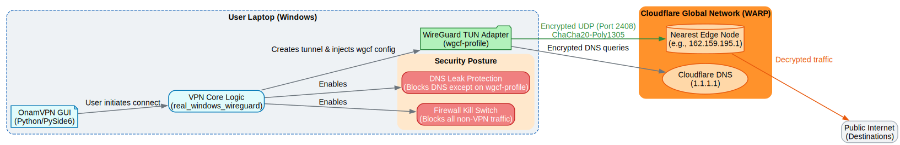

# OnamVPN

A modern, production-ready VPN implementation with a beautiful Python/PySide6 GUI, utilizing **WireGuard** and the **Cloudflare WARP Global Network** for unparalleled speed and security.



## 🌟 Features

- **Cloudflare WARP Backend**: Zero-configuration, free, enterprise-grade edge transit to global endpoints.
- **Auto-Connect**: Automatically pings all region servers on startup and instantly connects you to the lowest latency node.
- **Firewall Kill Switch**: Prevents any IP leaks blocking all outbound traffic automatically if the VPN tunnel drops.
- **DNS Leak Protection**: Forces all DNS queries through Cloudflare's encrypted DNS (1.1.1.1) within the tunnel.
- **Modern GUI**: Clean PySide6 interface with region-specific latency monitoring and dynamic theme support.

## 🏗️ Architecture

OnamVPN has evolved from a local Python proxy to a robust wrapper around the Windows `wireguard.exe` kernel service, directing traffic globally through Cloudflare WARP.



### Deep Dive

1. **GUI & System Tray**: The user clicks connect or the app auto-connects to the fastest server (ICMP ping measured).
2. **WireGuard Tunnel Creation**: The application generates a staging configuration file (`C:\OnamVPN\wgcf-profile.conf`) containing your registered WARP keys and the specific regional endpoint (e.g., Frankfurt `162.159.193.1:2408`).
3. **Tunnel Activation**: The application interfaces directly with `wireguard.exe /installtunnelservice` to create a new Wintun networking adapter named `wgcf-profile`.
4. **Security Enforcement**: 
    - A PowerShell script executes to create Windows Defender Firewall rules that block all internet traffic *except* the WireGuard interface and the specific Cloudflare endpoint IP (Kill Switch).
    - It also blocks port 53 (DNS) on all adapters except the VPN tunnel, enforcing encrypted DNS resolution.
5. **Global Transit**: All OS traffic is seamlessly encrypted using ChaCha20-Poly1305 and routed securely around the globe.

## 🚀 Quick Start

### Prerequisites

1. **Python 3.10+** installed.
2. **WireGuard for Windows** installed from [wireguard.com](https://www.wireguard.com/install/). It **must** be added to your system PATH.
3. The application **must** be run as an Administrator (required to manage Windows Services and Firewall rules).

### Installation & Execution

1. Clone or download the project:
```bash
git clone https://github.com/your-username/OnamVPN.git
cd OnamVPN
```

2. Setup virtual environment:
```bash
python -m venv venv
venv\Scripts\activate
pip install -r requirements.txt
```

3. Run the application (Requires Administrator Privileges):
```bash
python main.py
```

## 🔒 Security Posture

- **Encryption**: Standard WireGuard ChaCha20-Poly1305 encryption.
- **Kill Switch (Firewall Based)**: If `wgcf-profile` disconnects, Windows Firewall will immediately drop all external packets. No fallback to unencrypted connections.
- **DNS Leak Protection**: UDP/TCP Port 53 is hard-blocked on all non-VPN interfaces. Your ISP cannot see your DNS queries.

## 🎯 Usage

### Changing Servers
Select a server card (e.g., **New York**, **Frankfurt**, **Mumbai**) in the GUI and click Connect. Cloudflare's Anycast network combined with explicit regional endpoints automatically routes you through the edge node closest to that region.

### Auto-Connect
When you open the application, OnamVPN automatically sends ICMP ping packets to all configured Cloudflare endpoints. It calculates the fastest route and connects you within seconds.

## 🐛 Troubleshooting

### Common Issues

1. **"Failed to initiate connection"**: Ensure you have opened the application as **Administrator**. Standard users cannot create WireGuard tunnels.
2. **"wg.exe not found" or "wireguard.exe not recognized"**: You must install the official WireGuard Windows client and ensure its directory is in your System PATH.
3. **"Offline" Servers**: An offline server means the specific Cloudflare UDP edge node did not reply to an ICMP ping. Connect to a different region.


