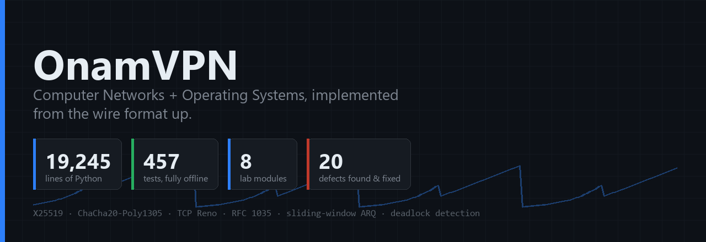
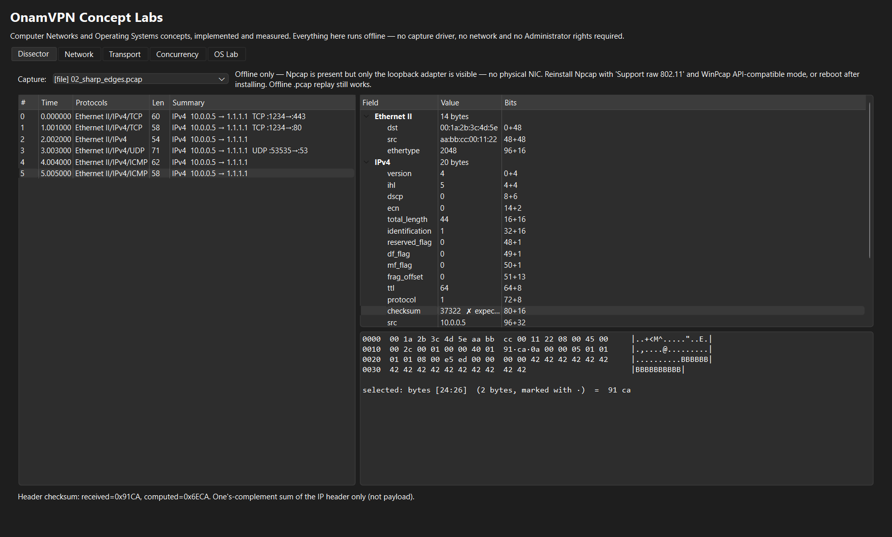
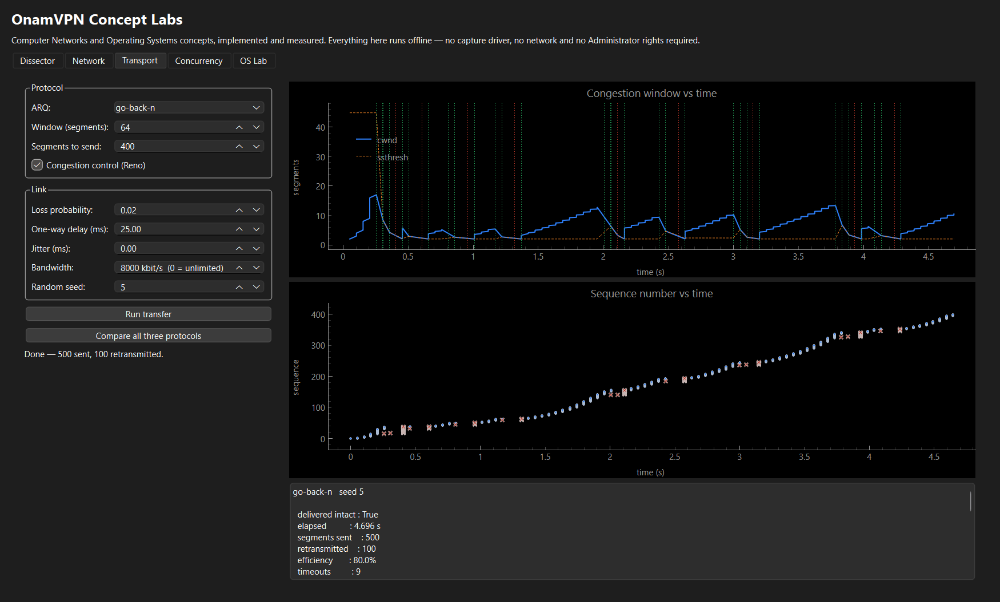
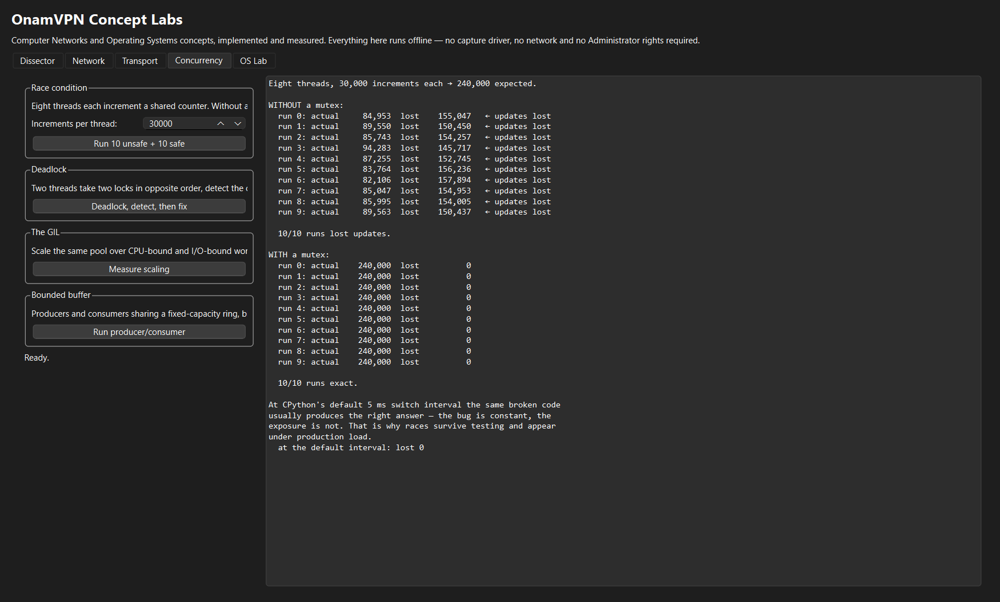

# OnamVPN — CN + OS Concept Laboratory

**Aditya Onam · IIT Patna** — Computer Networks + Operating Systems course project

> A VPN client built on WireGuard, **and** eight laboratory modules that reimplement
> the networking and operating-system mechanisms that client depends on — from the
> wire format up, in code you can read.

[](#verification)
[](#quick-start)
[](#quick-start)
[](LICENSE)

---

## Abstract

This project started as a GUI wrapper around `wireguard.exe`. Every concept in it —
key exchange, tunnelling, routing, congestion control — happened inside binaries
nobody here wrote, which made *"show me where you implement that"* unanswerable.

The rewrite moves those concepts into the repository. There is now a packet dissector
with hand-written protocol decoders, an encrypted tunnel with its own handshake and
replay window, three ARQ protocols under TCP Reno congestion control, a DNS stack
parsed from the RFC 1035 byte layout, traceroute assembled from ICMP primitives, and
a concurrency laboratory that demonstrates races and deadlock by **running the broken
code and watching it break**.

Everything runs offline: no capture driver, no network, no Administrator rights.

## The one idea

The client and the labs are not two projects. The labs explain the client.

| The client does this | The lab that explains it |
|---|---|
| Sends WireGuard UDP to `162.159.193.1:2408` | `netlab/dissect` decodes exactly those frames |
| Installs `0.0.0.0/1` + `128.0.0.0/1` routes | `netlab/path/routing.py` — why `/1` beats `/0` *without deleting it* |
| Claims DNS cannot leak | `netlab/dns/leaktest.py` — the first thing that **tests** the claim |
| Uses WireGuard's Noise_IK handshake | `netlab/native/crypto.py` — a reduction of it, written here |
| Sets `MTU = 1280` | `netlab/path/pmtud.py` — derives that number from header arithmetic |

---

## Quick start

```bash
python -m venv venv && venv\Scripts\activate
pip install -r requirements.txt

python main.py --labs          # the concept labs — no admin needed
python -m pytest tests/ -q     # 457 tests, offline
python main.py                 # the VPN client (requires Administrator)
```

---

## The five panels

### Dissector — hand-written protocol decoders



Six decoders (Ethernet/802.1Q, IPv4, IPv6, TCP with options, UDP, ICMP/ICMPv6),
grouped **by OSI layer** so the file structure is itself the lesson. Selecting a field
marks exactly the bytes it occupies — above, the corrupt IPv4 checksum at frame bytes
`[24:26]`, which is 14 (Ethernet) + 10 (IPv4 checksum offset).

`02_sharp_edges.pcap` contains six packets, each of which produced a wrong answer
during development. Exactly one is genuinely corrupt.

| # | Packet | What broke |
|---|---|---|
| 0 | 60-byte padded TCP SYN | Checksum computed over Ethernet padding → **every SYN/ACK/FIN flagged corrupt** |
| 1 | First fragment | Carries a real TCP header; its checksum covers the *reassembled* segment, so it cannot be verified from one fragment |
| 2 | Later fragment | Carries raw payload — the dispatcher descended into it and **invented ports and sequence numbers** |
| 3 | UDP checksum 0 | Legal on IPv4 (RFC 768); flagging it corrupt shows a false error |
| 4 | IPv4 options (IHL=6) | Variable-length header |
| 5 | Corrupted checksum | The only genuinely bad packet |

### Transport — ARQ and TCP Reno



Stop-and-Wait, Go-Back-N and Selective Repeat over a seeded impairment link, under
TCP Reno. The sawtooth is annotated: **green** lines are fast retransmit, **red** are
timeouts. A red line always collapses `cwnd` to one segment; a green one never does —
that asymmetry is the single most important thing on the graph.

Everything runs on a virtual clock, so the same seed produces a byte-identical trace
every run.

| At 20% loss, 100 segments | Retransmitted | Efficiency |
|---|---|---|
| Stop-and-Wait | 54 | 0.59 |
| **Go-Back-N** | **67** | 0.55 |
| **Selective Repeat** | **54** | 0.59 |

### Concurrency — races, deadlock and the GIL



**The race demo initially produced the correct answer 10 times out of 10.**

In CPython 3.12 the interpreter only checks its eval-breaker at call boundaries and
loop back-edges — not between arbitrary bytecodes — so `load; store` inside one
function body is effectively atomic. That is an artefact of one interpreter, not a
guarantee of the language.

Making it observable needed a realistic read-compute-write critical section and raised
scheduling pressure. Neither fabricates the bug; the code is equally broken either way.

**And at the default 5 ms switch interval it still hides** — asserted as a test. That
is the lesson: *the bug is constant, the exposure is not*, which is why races survive
testing and surface under production load.

The GIL, measured rather than asserted:

```
CPU-bound (pure Python)          I/O-bound (blocking sleep)
  1 worker  2.000s   1.00×         1 worker  0.813s   1.00×
  8 workers 1.531s   1.31×         8 workers 0.125s   6.50×
```

Threads help exactly when the work waits.

### Network — the tunnel, DNS and path

Our own VPN: X25519 → HKDF → ChaCha20-Poly1305, with an RFC 6479 sliding-window
replay filter and a SOCKS5 front end. DNS resolved four ways (UDP / TCP / DoT / DoH)
with the wire format parsed by hand, including compression pointers. Traceroute built
from TTL expiry and ICMP Time Exceeded, plus longest-prefix match over the live
routing table.

### OS Lab — scheduling, memory, resilience

FCFS / SJF / Round Robin / Priority over real measured probe durations with Gantt
rendering; a slab allocator with reuse and fragmentation statistics; a cross-process
single-instance lock and a crash-recovery journal.

---

## Repository layout

```
netlab/                         Computer Networks modules
  dissect/   model · tables · checksums · link(L2) · internet(L3) ·
             transport(L4) · dispatch · capture        ← grouped by OSI layer
  native/    protocol · crypto · replay · session · endpoint · socks5 · runner
  transport/ impairment · arq · rtt · congestion · harness
  dns/       wire · resolver · cache · leaktest
  path/      traceroute · routing · pmtud
oslab/                          Operating Systems modules
  concurrency/ ring · pool · deadlock
  scheduling/  algorithms          memory/    bufferpool
  resilience/  atomicio · signals · singleton
  ipc/         framing             daemon/    ops
vpn_core/                       the original WireGuard client
gui/panels/                     five Qt panels + Labs window
docs/concepts/                  9 pages, one per module
docs/samples/                   3 committed .pcap fixtures + golden decodes
tests/                          457 tests
```

| Package | Lines of Python |
|---|---|
| `netlab/` | 6,956 |
| `oslab/` | 2,671 |
| `gui/` | 3,694 |
| `tests/` | 3,888 |
| **Total** | **19,245** |

---

## Verification

```
457 passed in ~57s      offline · no admin · no network
```

| File | Tests | File | Tests |
|---|---|---|---|
| `test_native.py` | 80 | `test_capture.py` | 43 |
| `test_headers.py` | 67 | `test_path.py` | 37 |
| `test_oslab.py` | 58 | `test_dns.py` | 37 |
| `test_transport.py` | 57 | `test_concurrency.py` | 33 |
| `test_foundation.py` | 45 | | |

The decoders are cross-checked field by field against **Scapy 2.6.1** — a separate
implementation by different authors, so agreement is meaningful evidence rather than
self-confirmation. Golden files catch unintended change but only pin the decoders
against themselves; the Scapy comparison is the real check.

---

## Defects found and fixed

Twenty, and *how* they were found is the point. A representative few:

| Defect | Consequence |
|---|---|
| TCP checksum computed over Ethernet padding | **Every SYN, ACK and FIN reported BAD CHECKSUM** — the first packets anyone captures |
| `carries_transport_header()` added, never called | Later IP fragments decoded as TCP, **inventing ports from raw payload** |
| DNS-leak firewall rules | Windows evaluates **Block before Allow**, so a blanket block plus a tunnel-scoped allow blocked *all* DNS |
| `chunk_payload` written, tested, never called | **200 KB arrived as 134 KB** — oversized datagrams IP-fragmented, one lost fragment killed each |
| File logging never worked | Every log 0 bytes since Oct 2025 — handlers attached to `"OnamVPN"` while modules used `get_logger(__name__)` |
| Connect blocked the Qt event loop | 4–10 s frozen UI — measured **1 event-loop tick**, now **64** |
| Startup latency scan was serial | **6.23 s → 1.11 s** (5.6×) |
| Deadlock cycle detector | **False positive** on a simple chain — worse than a miss |

**The pattern worth noticing:** three of these were the same shape — a module written,
unit-tested, and never wired to anything. Unit tests do not catch *"nothing calls
this"*; only an integration test does.

---

## Known gaps

Stated plainly, because saying it out loud is a strength.

| Gap | Detail |
|---|---|
| 🔴 **WARP tunnel connects, then disappears** | Service shows `RUNNING`, then vanishes; no Wintun adapter; traffic never leaves via the tunnel. Leading hypothesis: the hardcoded WARP key is deregistered. See [`docs/OPEN_ISSUE_tunnel.md`](docs/OPEN_ISSUE_tunnel.md) |
| **Native tunnel has no retransmission** | It carries TCP *stream bytes*, not IP packets, so a dropped datagram removes bytes with nothing to repair them. `netlab/transport` is the layer that would fix it; they are not wired together |
| **No DoS defence in the tunnel** | No cookie mechanism, therefore no mac2 |
| **Module F is framing only** | Named-pipe transport and elevated helper not built — a flawed privilege boundary is worse than none |
| **Live capture unavailable here** | Npcap enumerates only loopback. Offline `.pcap` replay works fully |
| **DoT/DoH blocked by this network** | `cloudflare-dns.com` does not resolve; TCP opens on `:853` but TLS times out, while ordinary HTTPS returns 200. A middlebox blocking encrypted DNS — which is *precisely* the argument for DoH on port 443 |

Use WireGuard for anything real. The native tunnel exists to make the mechanism
legible, not to secure traffic.

---

## Documentation

Nine pages in [`docs/concepts/`](docs/concepts/README.md), one per module — each with
the concepts mapped to `file.py:line`, how to run it, expected output, **what a wrong
result looks like**, and what the module does not do.

---

## License

[MIT](LICENSE) © 2026 Aditya Onam
